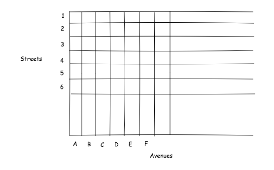

## Instructions for Processing the data
The streets are mostly in a grid pattern. Streets identified by numbers (1, 2, 3, ...). Avenues identified by letters (A, B, C, ...) run from north to south or from south to north, with avenue A being the westernmost avenue. 

The program will need to read the data and then find good routes between different pairs of intersections. Intersections are identified by the names of the avenue and street that intersect at the intersection. For example, an intersection may be identified by the combination of Avenue F and street 24.

## Detailed requirements

The format of the data is JSON. It looks like this:

```json
{
  "trafficMeasurements": [
    {
      "measurementTime": 83452,
      "measurements": [
        {
          "startAvenue": "A",
          "startStreet": "1",
          "transitTime": 59.57363899660943,
          "endAvenue": "A",
          "endStreet": "2"
        },
        {
          "startAvenue": "A",
          "startStreet": "2",
          "transitTime": 40.753916740023314,
          "endAvenue": "A",
          "endStreet": "3"
        },
        ⋮
      ]
    },
    {
      "measurementTime": 83556,
      "measurements": [
        ⋮
      ]
  ]
}
```

When the program is selecting a good route from one intersection to the other, it should select the route with the smallest total transit time. The transit times for each road segment vary from one measurement to the next. You should base the transit time on some sort of average for each road segment.

